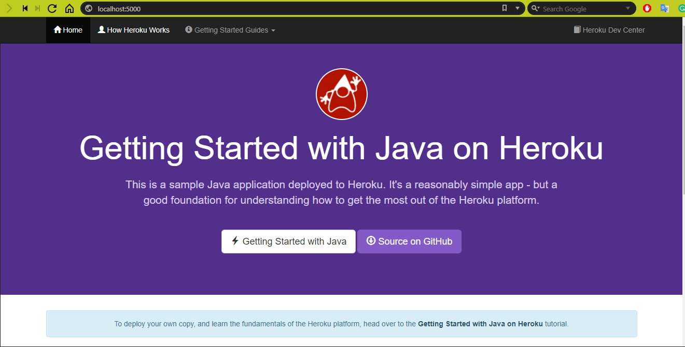

# workshop8

- Execute the app in localhost. (Add screenshot)
 
- What the application do?
    + Answer: is a register of users and cars.
- Describe the REST services exposed by the application.
    + the Rest services are:
        * Consult all cars and users
        * Create a car and a user
        * Update a car and a user
        * Delete a car and a user
- For what purpose is the Procfile plaintext file? 
    + is the file that contains the run configuration 

url: [heroku api](https://heroku-app-arsw.herokuapp.com)